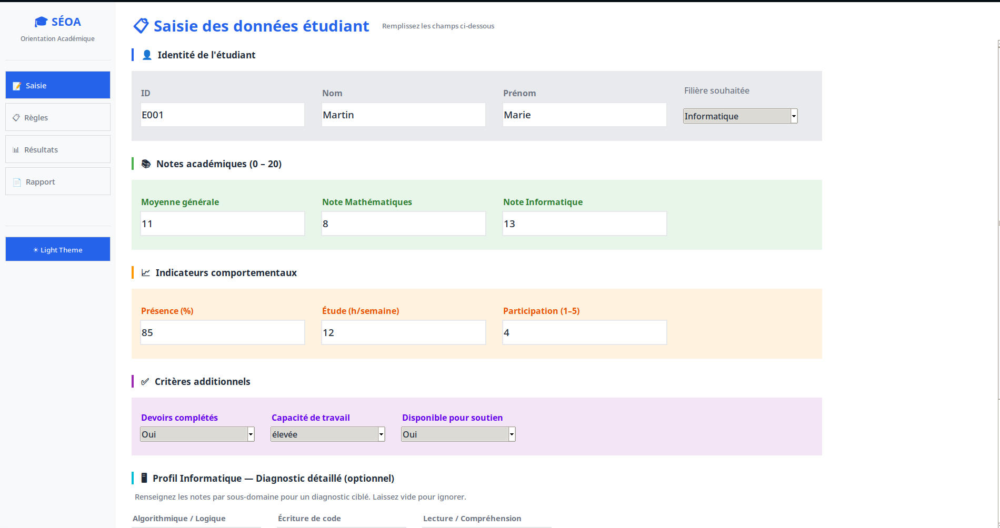

# SÉOA — Système Expert d'Orientation Académique 🎓

SÉOA est un système expert d'aide à la décision conçu avec **Tkinter** (interface graphique) et implémentant un **moteur d'inférence en chaînage avant**. Il permet d'évaluer le profil académique et comportemental des étudiants afin de recommander une orientation adaptée ainsi que des dispositifs de soutien pédagogique ciblés.

## Fonctionnalités

- **Saisie complète des données** : Identité, notes académiques (Maths, Info, Moyenne) et indicateurs comportementaux (présence, heures d'étude).
- **Moteur d'inférence (Chaînage avant)** : Raisonnement structuré en 4 phases (Motivation → Potentiel → Orientation → Diagnostic Informatique).
- **Diagnostic CS détaillé** : Analyse approfondie des sous-compétences informatiques (Algorithmique, Base de données, Réseaux, etc.).
- **Gestion des thèmes** : Bascule dynamique entre un thème Clair (Light) et Sombre (Dark).
- **Export des rapports** : Sauvegarde automatique de la session et exportation des bilans aux formats HTML, TXT et JSON.

## Structure du Projet

- `models.py` : Structures de données (Dataclasses) pour les étudiants, bases de faits et résultats.
- `rules.py` : Base de règles logiques (SI - ALORS).
- `inference_engine.py` : Implémentation du moteur d'inférence.
- `support_system.py` : Catalogue et logique de recommandation des dispositifs de soutien.
- `gui.py` : Interface graphique Tkinter professionnelle.
- `main.py` : Point d'entrée de l'application en mode console.

## Installation et Lancement

1. Lancez l'interface graphique :
   ```bash
   python gui.py
   ```
1.1 Ou utilisez la version console :
```bash
    python main.py
```




## Video
<video src="./assets/pocvideo.gif" controls preload></video>

